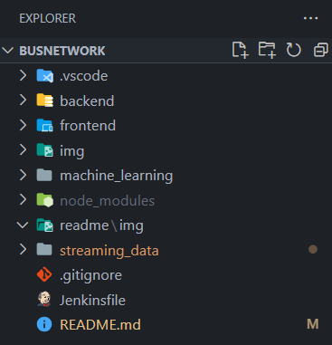

# MemeGroup - Project Bus network - Bus Radar

## Introduction
This web application helps the Bus Operator:
- View the current state of public bus network traffic (the bus position, the routes)
- Predict the bus traffic congestion ahead of 15 minutes

## Team members
| No. | Full name             | ID    | Agile Role                           | Progress |
|-----|-----------------------|-------|--------------------------------------|----------|
| 1   | Vu Hoang Tuan Anh     | 18812 | Back-end Developer, Machine Learning | 100%     |
| 2   | Vo Nguyen Duy Bach    | 16770 | Full-stack Developer                 | 100%     |
| 3   | Tran Kim Hoan         | 18810 | Front-end Developer, Tester          | 100%     |
| 4   | Tran Nguyen Minh Quan | 17640 | Scrum Master, DevOps, Data Engineer  | 100%     |

## Programming Languages and Frameworks

---
## Web Application
### Requirements
- Nodejs v21.4.0 or newer version. 
    - Download [here](https://nodejs.org/en). (After downloading, please install immediately)
- Python 3.12.1 or newer version. 
    - Download [here](https://www.python.org/downloads/). (After downloading, please install immediately)
- Kafka 2.13-3.6.0 or newer version:
    - Download [here](https://kafka.apache.org/downloads). (After downloading, please leave it and wait for the installation step in the Project Setup section)
- Visual Studio Code IDE with Code Runner extension
    - Download VSCode IDE first [here](https://code.visualstudio.com/)
    - Download Code Runner extension for VSCode from [here](https://marketplace.visualstudio.com/items?itemName=formulahendry.code-runner)


### Project Setup
This instructions assume that the environment operating system is Windows (Recommend using [Powershell 7](https://github.com/PowerShell/PowerShell) as the main terminal)

#### 1. Clone the project

- using SSH

    ```bash
    git clone git@github.com:VGU-Meme-Group/busnetwork.git
    ```

- or using HTTPS:

    ```bash
    https://github.com/VGU-Meme-Group/busnetwork.git
    ```

#### 2. Open the project

- Open the project by using VSCode IDE (Recommended for convenience) <br>



#### 3. Set up Streaming Data Server

- __(Run the Kafka Server)__ Locate the kafka binary file you just downloaded into your machine. Assume the file name is ___kafka_2.13-3.6.0.tgz___
    - Then copy the file ___kafka_2.13-3.6.0.tgz___ to a folder on your machine. Here I copy it to my ___C:/___ drive to avoid the folder name length limit of Kafka. (Now I have ___C:/kafka_2.13-3.6.0.tgz___) 
    - On the ___C:/___ folder, open the terminal and then using this command to extract the Kafka folder:

        ```bash
        tar -xzf .\kafka_2.13-3.6.0.tgz
        ```

    - Then change directory to ___kafka_2.13-3.6.0/___

        ```bash
        cd kafka_2.13-3.6.0
        ```
    
    - After that, open 2 terminals from the directory ___C:/kafka_2.13-3.6.0/___ and run these following commands:
        - 1st Terminal (execute the ZooKeeper Server):

            ```bash
            .\bin\windows\zookeeper-server-start.bat .\config\zookeeper.properties 
            ```
        
        - 2nd Terminal (executes the Kafka Server):

            ```bash
            .\bin\windows\kafka-server-start.bat .\config\server.properties
            ```


- __(Run the Kafka Spring Boot Application)__  Locate the folder [streaming_data](streaming_data/):

    ```bash
    cd streaming_data
    ```

    - From here, we locate the next 3 files in the following paths and then execute them respectively using the "Run ▶️" button of the Code Runner extension in VSCode:
        - [streaming_data/API/src/main/java/com/project/SpringBootAPIApplication.java](streaming_data/API/src/main/java/com/project/SpringBootAPIApplication.java)