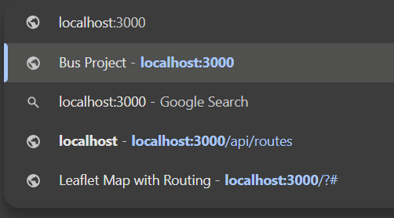
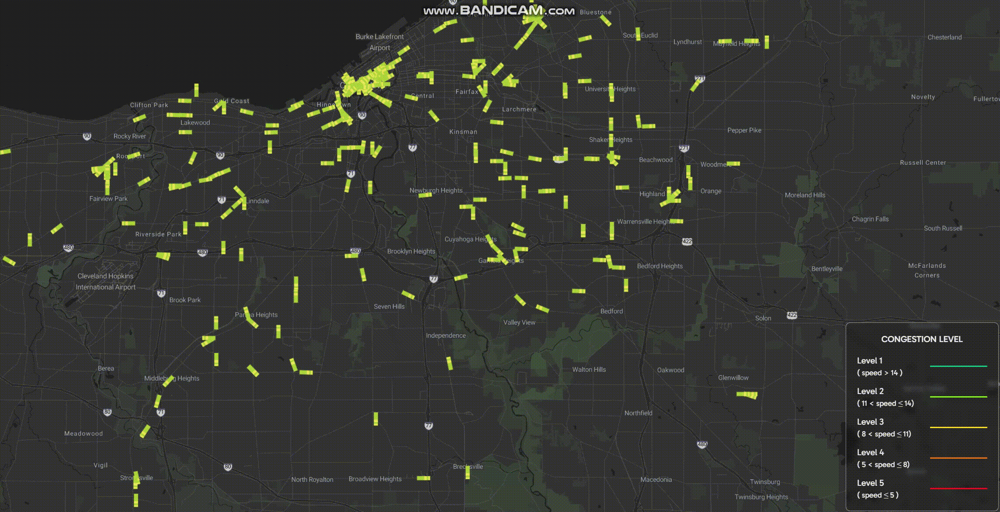

# MemeGroup - Project Bus network - Bus Radar

## Introduction
This web application helps the Bus Operator:
- View the current state of public bus network traffic (the bus position, the routes)
- Predict the bus traffic congestion ahead of 15 minutes

## Team members
| No. | Full name             | ID    | Agile Role                           | Progress |
|-----|-----------------------|-------|--------------------------------------|----------|
| 1   | Vu Hoang Tuan Anh     | 18812 | Back-end Developer, Machine Learning | 100%     |
| 2   | Vo Nguyen Duy Bach    | 16770 | Full-stack Developer                 | 100%     |
| 3   | Tran Kim Hoan         | 18810 | Front-end Developer, Tester          | 100%     |
| 4   | Tran Nguyen Minh Quan | 17640 | Scrum Master, DevOps, Data Engineer  | 100%     |

## Programming Languages
 ![Java][Java.java]
 ![Python][Python.py]
 [![HTML][HTML.html]][HTML-url]
 [![CSS][CSS.css]][CSS-url]
 [![JavaScript][JavaScript.js]][JavaScript-url]


## Databases
 ![MongoDB][MongoDB.db]


## Frameworks
[![NodeJs][NodeJs.js]][NodeJs-url]
![ReactJS][React.js]
![Vue][Vue.js]
![Leaflet][Leaflet.js]
![Jest][Jest.js]
![SpringBoot][SpringBoot.java]

## Tools
![Jira][Jira.jira]
![Jenkins][Jenkins.jenkins]
![Kafka][Kafka.pb]
[![Docker][Docker.dockerfile]][Docker-url]

---
## Web Application
### Requirements
- Nodejs v21.4.0 or newer version. 
    - Download [here](https://nodejs.org/en). (After downloading, please install immediately)
- Python 3.12.1 or newer version. 
    - Download [here](https://www.python.org/downloads/). (After downloading, please install immediately)
- Kafka 2.13-3.6.0 or newer version:
    - Download [here](https://kafka.apache.org/downloads). (After downloading, please leave it and wait for the installation step in the Project Setup section)
- Visual Studio Code IDE with Code Runner extension
    - Download VSCode IDE first [here](https://code.visualstudio.com/)
    - Download Code Runner extension for VSCode from [here](https://marketplace.visualstudio.com/items?itemName=formulahendry.code-runner)
- Any Internet Browser:
    - Google Chrome (Recommend), Firefox, Microsoft Edge, Opera, Brave, Safari, etc.


### Project Setup
This instructions assume that the environment operating system is Windows (Recommend using [Powershell 7](https://github.com/PowerShell/PowerShell) as the main terminal)

#### 1. Clone the project

- using SSH

    ```bash
    git clone git@github.com:VGU-Meme-Group/busnetwork.git
    ```

- or using HTTPS:

    ```bash
    https://github.com/VGU-Meme-Group/busnetwork.git
    ```

#### 2. Open the project

- Open the project by using VSCode IDE (Recommended for convenience) <br>
    


#### 3. Set up Streaming Data Server

- __(Run the Kafka Server)__ Locate the kafka binary file you just downloaded into your machine. Assume the file name is ___kafka_2.13-3.6.0.tgz___
    - Then copy the file ___kafka_2.13-3.6.0.tgz___ to a folder on your machine. Here I copy it to my ___C:/___ drive to avoid the folder name length limit of Kafka. (Now I have ___C:/kafka_2.13-3.6.0.tgz___) 
    - On the ___C:/___ folder, open the terminal and then using this command to extract the Kafka folder:

        ```bash
        tar -xzf .\kafka_2.13-3.6.0.tgz
        ```

    - Then change directory to ___kafka_2.13-3.6.0/___

        ```bash
        cd kafka_2.13-3.6.0
        ```
    
    - After that, open 2 terminals from the directory ___C:/kafka_2.13-3.6.0/___ and run these following commands:
        - 1st Terminal (execute the ZooKeeper Server):

            ```bash
            .\bin\windows\zookeeper-server-start.bat .\config\zookeeper.properties 
            ```
        
        - 2nd Terminal (executes the Kafka Server):

            ```bash
            .\bin\windows\kafka-server-start.bat .\config\server.properties
            ```


- __(Run the Kafka Spring Boot Application)__  Locate the folder [streaming_data](streaming_data/):

    ```bash
    cd streaming_data
    ```

    - From here, we locate the next 3 files in the following paths and then execute them respectively by clicking the "Run ▶️" button of the Code Runner extension in VSCode:
        - 1st: [streaming_data/API/src/main/java/com/project/SpringBootAPIApplication.java](streaming_data/API/src/main/java/com/project/SpringBootAPIApplication.java)
        - 2nd: [streaming_data\kafka-consumer\src\main\java\com\project\SpringBootConsumerApplication.java](streaming_data\kafka-consumer\src\main\java\com\project\SpringBootConsumerApplication.java)
        - 3rd: [streaming_data\kafka-producer\src\main\java\com\project\SpringBootProducerApplication.java](streaming_data\kafka-producer\src\main\java\com\project\SpringBootProducerApplication.java)

#### 4. Set up Back-end Server
- Locate the [backend](backend/) folder:

    ```bash
    cd backend
    ```

- Then install the necessary node modules by using these commands (Make sure that Nodejs have been installed on your machine):

    ```bash
    npm install
    ```

- Then we run 2 API Services of the backend in 2 terminals:
    - 1st terminal: 
    
        ```bash
        node index.js
        ```

    - 2nd terminal:

        ```bash
        node main.js
        ```

#### 5. Set up Machine Learning Server
- Locate the [Machine Learning](machine_learning/) folder:

    ```bash
    cd machine_learning
    ```

- Make sure that you have installed Python on your machine, after that, using this command to install all necessary packages:

    ```bash
    pip install -r requirements.txt
    ```

- Then we run the Machine Learning (Prediction) Server by using this command:

    ```bash
    python Server.py    
    ```

#### 6. Set up Front-end
- Locate the [frontend](frontend/) folder:

    ```bash
    cd frontend
    ```

- Then install the necessary node modules by using these commands (Make sure that Nodejs have been installed on your machine):

    ```bash
    npm install
    ```

- Finally, execute this command to enables the GUI of the Web application:

    ```bash
    npm run dev
    ```

7. Access the Web Application
- Now, all you need to do is just open your internet browser (E.g: Google Chrome) and then type the address ```localhost:3000``` on your address bar, then press Enter.

    

- Then the GUI will look like this:

    


[HTML.html]: https://img.shields.io/badge/HTML5-E34F26?style=for-the-badge&logo=html5&logoColor=white
[HTML-url]: https://html.spec.whatwg.org/
[CSS.css]: https://img.shields.io/badge/CSS3-1572B6?style=for-the-badge&logo=css3&logoColor=white
[CSS-url]: https://www.w3.org/TR/CSS/#css
[JavaScript.js]: https://img.shields.io/badge/JavaScript-F7DF1E?style=for-the-badge&logo=javascript&logoColor=black
[JavaScript-url]: https://www.ecma-international.org/publications-and-standards/standards/ecma-262/
[PHP.php]: https://img.shields.io/badge/PHP-777BB4?style=for-the-badge&logo=php&logoColor=white
[PHP-url]: https://www.php.net/
[MySQL.db]: https://img.shields.io/badge/MySQL-005C84?style=for-the-badge&logo=mysql&logoColor=white
[MySQL-url]: https://www.mysql.com/
[MongoDB.db]: https://img.shields.io/badge/MongoDB-4EA94B?style=for-the-badge&logo=mongodb&logoColor=white
[Postgresql.db]: https://img.shields.io/badge/PostgreSQL-316192?style=for-the-badge&logo=postgresql&logoColor=white
[Docker.dockerfile]: https://img.shields.io/badge/Docker-0377FC?style=for-the-badge&logo=docker&logoColor=white
[Docker-url]: https://www.docker.com/
[Bootstrap.css]: https://img.shields.io/badge/Bootstrap-563D7C?style=for-the-badge&logo=bootstrap&logoColor=white
[Bootstrap-url]: https://getbootstrap.com/
[Less.js]: https://img.shields.io/badge/less-2B4C80?style=for-the-badge&logo=less&logoColor=white
[NodeJs.js]: https://img.shields.io/badge/Node.js-43853D?style=for-the-badge&logo=node.js&logoColor=white
[NodeJs-url]: https://nodejs.org/
[Android.apk]: https://img.shields.io/badge/Android-3DDC84?style=for-the-badge&logo=android&logoColor=white
[Android-url]: https://www.android.com/
[Debian.deb]: https://img.shields.io/badge/Debian-A81D33?style=for-the-badge&logo=debian&logoColor=white
[Debian-url]: https://www.debian.org/
[KaliLinux.deb]: https://img.shields.io/badge/Kali_Linux-557C94?style=for-the-badge&logo=kali-linux&logoColor=white
[KaliLinux-url]: https://www.kali.org/
[Ubuntu.deb]: https://img.shields.io/badge/Ubuntu-E95420?style=for-the-badge&logo=ubuntu&logoColor=white
[Ubuntu-url]: https://ubuntu.com/
[Windows.exe]: https://img.shields.io/badge/Windows-0078D6?style=for-the-badge&logo=windows&logoColor=white
[Windows-url]: https://www.microsoft.com/en-us/windows
[C.c]: https://img.shields.io/badge/C-00599C?style=for-the-badge&logo=c&logoColor=white
[C++.cpp]: https://img.shields.io/badge/C%2B%2B-00599C?style=for-the-badge&logo=c%2B%2B&logoColor=white
[Java.java]: https://img.shields.io/badge/Java-ED8B00?style=for-the-badge&logo=openjdk&logoColor=white
[R.R]: https://img.shields.io/badge/R-276DC3?style=for-the-badge&logo=r&logoColor=white
[Matlab.m]: https://img.shields.io/badge/Matlab-00599C?style=for-the-badge&logo=matlab&logoColor=white
[Python.py]: https://img.shields.io/badge/Python-3776AB?style=for-the-badge&logo=python&logoColor=white
[React.js]: https://img.shields.io/badge/React-20232A?style=for-the-badge&logo=react&logoColor=61DAFB
[Jenkins.jenkins]: https://img.shields.io/badge/Jenkins-D24939?style=for-the-badge&logo=Jenkins&logoColor=white
[Jira.jira]: https://img.shields.io/badge/Jira-0052CC?style=for-the-badge&logo=Jira&logoColor=white
[Vue.js]: https://img.shields.io/badge/Vue.js-35495E?style=for-the-badge&logo=vue.js&logoColor=4FC08D
[Leaflet.js]: https://img.shields.io/badge/Leaflet-47A141?style=for-the-badge&logo=Leaflet&logoColor=white
[Jest.js]: https://img.shields.io/badge/Jest-E34F26?style=for-the-badge&logo=Jest&logoColor=white
[SpringBoot.java]: https://img.shields.io/badge/Spring-6DB33F?style=for-the-badge&logo=spring&logoColor=white
[Kafka.pb]: https://img.shields.io/badge/Kafka-20232A?style=for-the-badge&logo=Kafka&logoColor=white